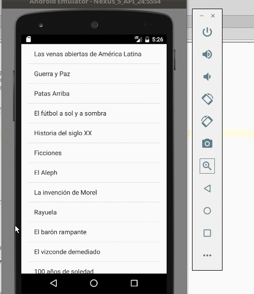

# Master/Detail de Libros en Android

Es una aplicación simple que muestra una lista de libros con una list view de una sola columna.
Al seleccionar un libro te lleva a la ventana de detalle donde muestra el autor de dicho libro.

## El proyecto
Este proyecto está generado para

* Android Studio 2.2 (Septiembre 2016)
* con Gradle 2.14.1 (el que viene con Android Studio)
* para una SDK 24 (Nougat)

## Conceptos que se ven en la app

* Uso de Activities vs. Fragment para manejar diferentes dispositivos
* Navegación entre vistas mediante el uso de Intent

## Branches

* **master**: la versión simple, el repositorio es un Singleton que devuelve todos los libros
* **rest**: en la versión REST la información de los libros se obtiene de un [servicio REST que podés correr como aplicación embebida de Eclipse o bien como aplicación aislada (consume menos recursos)](https://github.com/uqbar-project/eg-biblioteca-xtrest)

